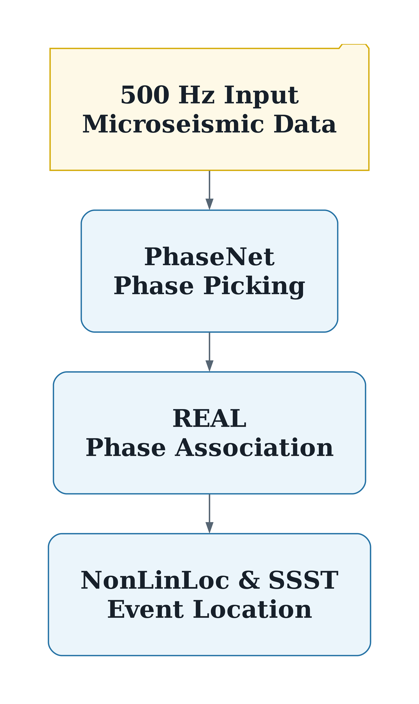

# SeisBench-REAL-NonLinLoc-SSST

Earthquake processing workflow for:

1. SeisBench phase picking
2. REAL phase association
3. NonLinLoc location
4. NonLinLoc/SSST relocation

This repository is a focused LOC-FLOW-derived workflow. The standalone
PhaseNet, EQTransformer/OBSTransformer, STA/LTA, HypoInverse, hypoDD,
GrowClust, Match&Locate, magnitude, and plotting modules from the broader
LOC-FLOW distribution are intentionally not included.

## Associated Paper

This repository contains the code used for the study:

Khosravi et al., "Machine Learning-Based Automatic Microseismic Event
Detection During the 17 August 2015 M_w 4.6 Induced Earthquake Sequence in
Northern Montney, British Columbia, Canada."

## Data And Code Availability

The data used in this study, including the event catalog and continuous
waveform data, cannot be shared due to confidentiality and data-sharing
restrictions imposed by the operator and project partners. The code used for
this study is publicly available at:
https://github.com/MHkhosravi/SeisBench-REAL-NonLinLoc-SSST

## Workflow



Source figure: [docs/figures/workflow.pdf](docs/figures/workflow.pdf)

## Layout

```text
Data/          waveform download and SeisBench input preparation
Pick/SeisBench SeisBench picker wrapper and REAL-compatible pick outputs
REAL/          REAL association scripts and travel-time table tools
NonLinLoc/     NonLinLoc and SSST preparation/run scripts
src/           helper scripts for external software download/install notes
```

## Basic Use

Edit the configuration values at the top of `run_all.sh`, then run:

```bash
bash run_all.sh
```

The default workflow skips data download, runs SeisBench picking, runs REAL
association, and leaves NonLinLoc/SSST disabled until you turn those flags on.

## SeisBench Picking

The picker wrapper reads the standard waveform layout:

```text
Data/waveform_sac/YYYYMMDD/NET.STA.CHANNEL
Data/station.dat
```

and writes REAL-compatible pick files:

```text
Pick/SeisBench/picks/PhaseNet_original/YYYYMMDD/NET.STA.P.txt
Pick/SeisBench/picks/PhaseNet_original/YYYYMMDD/NET.STA.S.txt
```

Examples:

```bash
python3 Pick/SeisBench/runseisbench.py --models PhaseNet_original --start-date 2016-10-14 --nday 1 --device auto
python3 Pick/SeisBench/runseisbench.py --models PhaseNet_original,PhaseNet_stead,EQTransformer_stead --device all
```

More options are documented in `Pick/SeisBench/readme`.

## REAL Association

After SeisBench picking, run REAL with the same model label:

```bash
cd REAL
perl runREAL.pl PhaseNet_original
```

`runREAL.pl` reads:

```text
../Pick/SeisBench/picks/<model_label>/YYYYMMDD
../Data/station.dat
./tt_db/ttdb.txt
```

and writes the merged association files used by NonLinLoc, including:

```text
REAL/phase_allday.txt
REAL/catalog_allday.txt
REAL/phaseSA_allday.txt
```

## NonLinLoc And SSST

Initial NonLinLoc location:

```bash
cd NonLinLoc
bash run_nonlinloc.sh
```

Iterative SSST relocation:

```bash
cd NonLinLoc
bash run_ssst_relocations.sh
```

Before final runs, edit the study-specific grid, reference coordinates,
velocity model, datum shift, pick errors, and minimum phase counts in the
NonLinLoc scripts.

## External Software

The runtime commands expected on `PATH` are:

```text
REAL
Vel2Grid
Grid2Time
NLLoc
Loc2ssst
LocSum
```

See `src/software_download.py` and `src/run_install.sh` for helper notes on
fetching and staging REAL and NonLinLoc binaries.

## Credits

This focused workflow builds on LOC-FLOW and related tools. Please cite the
original packages you use in your work:

- LOC-FLOW: Zhang et al., 2022, doi: 10.1785/0220220019
- REAL: Zhang, Ellsworth, and Beroza, 2019, doi: 10.1785/0220190052
- NonLinLoc: Lomax et al., 2000, doi: 10.1007/978-94-015-9536-0_5
- SeisBench: Woollam et al., 2022, doi: 10.1785/0220210324
